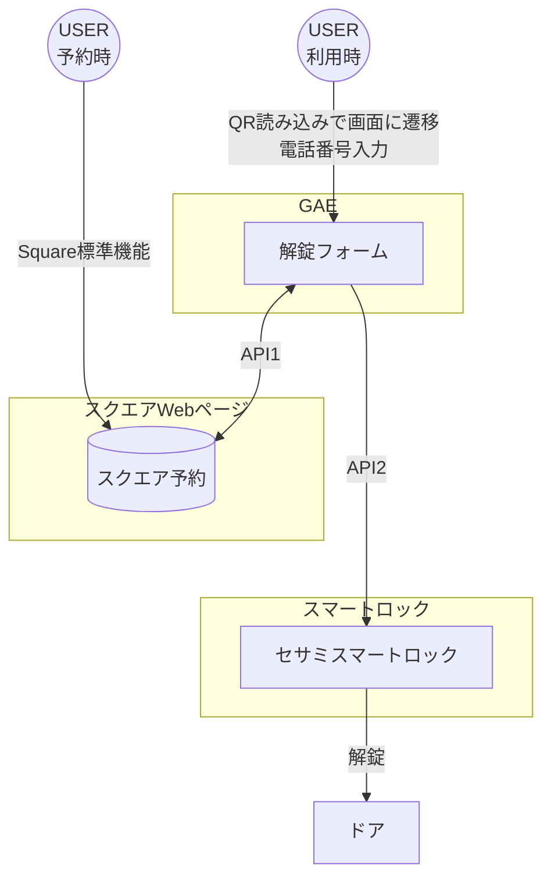
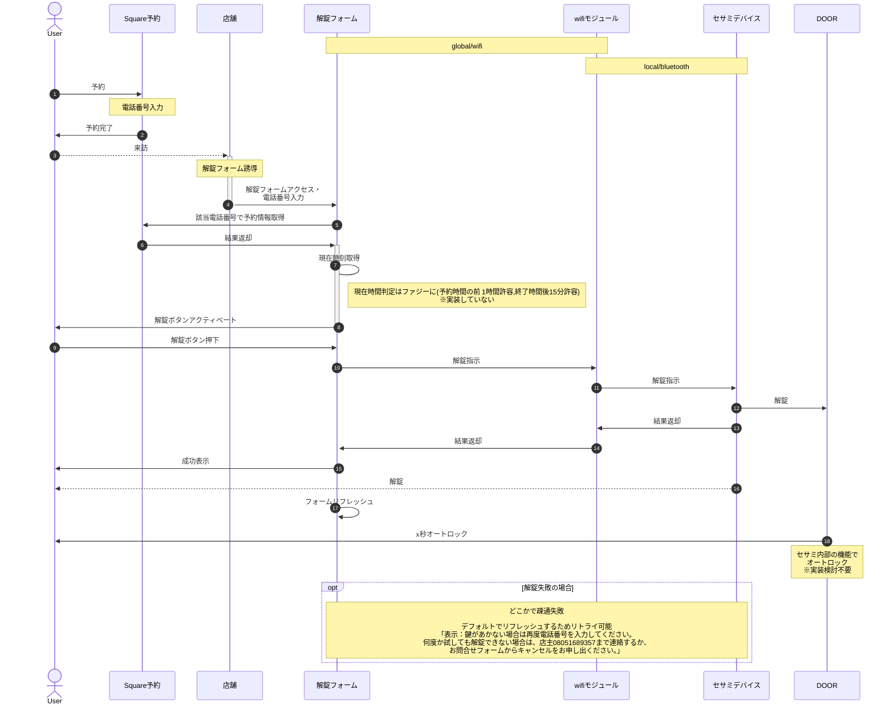

# 「だれかの書斎」フレームワーク

## 0.概要

書肆書斎の無人営業形態を「だれかの書斎」と名付ける。
「書斎」には、「本を読む空間」「ゆっくりと思考を巡らす空間」「仕事をする空間」などの多義性がある。
店主の書斎として始まった空間だが思ったよりもうまくできたので、これを第三者に提供する。

~~多義的な書斎のユースケースと、「書肆」=「本屋」という部分はすべて共通点と相容れない点があるため、運用設計上で濃淡を付けて共存を目指していく。~~

*コワーキングスペースとしての値段設定と、気軽に入れる本屋としての値段設定で悩んだが、最初は分けないことにした。

## 1.本リポジトリについて

「書肆書斎」の無人営業、「だれかの書斎」を営業するためのシステムを開発する。
このリポジトリ(Readme)上には実装内容だけでなく、全体のビジネスモデル（料金や利用規約など）の検討内容と結果も記載する。
プロジェクト全体の可読性・再利用性を可能な限り高め、ナレッジを水平展開・垂直展開をできるようにする。

構成

- README = このページ。実装内容以外の検討内容、実装内容の説明などはここに書く。
- denforsomeone.js = Node.jsと、GAEを用いて実装したコードの実物。

## 2.前提事項

### ◆顧客体験観点

- 顧客は入場予約と事前決済をweb上で行えること
- 予約と決済が完了している顧客は入口のスマートロックを解錠できること
- イレギュラーケースの対応も検討する

### ◆ビジネス観点/運用観点

- 閉店の間の機会損失

  - 企業活動としての機会損失ではなく、書肆書斎自体の収支の正常性が**店主の家庭と、書肆書斎の両立**すなわち、書肆書斎自体の持続可能性に直結するという点で、**最小限の労力**で売上を最大化させる必要性がある。
- 店主が本を読む空間（書斎）として最適化されており、空間としての魅力がある。また、コワーキングスペースとしての提供も想定して構築しており、椅子・机・電源・wifiは提供可能。飲み物はなし。
- 清潔さ：重要な視点。　スペース自体の価値を大きく既存するため「トイレ利用不可」「ゴミ箱利用不可」とする。　　

#### ◆無人本屋として、及び課金体系と運用思想

- 梅ヶ丘駅には本屋はなく、駅からのアクセスもいいことから、本屋としての価値がある。
- **課金体系**:無償開放の上、本の売上を期待してもいいが、リピート顧客の心理的負担と、顧客トラブルの戦略的排除手段として**廉価**で有償化することが適切
- **運用思想**:いわゆる本屋として~~時間枠や、同時入店者数は区切らない。~~入店〜退店は性善説で運用する。
  - 気になる本を１冊買ってすぐ帰っても、数時間かけて読破してもいい。
- *当初は時間枠や同時入店を区切らないオープンな運用を目指したが、Squareの仕様上、予約枠と人数に制限が出るため、これは実装してない。ただし、出場は管理しない。

#### ◆コワーキングスペースとして、及び課金体系と運用思想

- 上記の通り、簡易な作業スペースとして利用可能なので、コワーキングスペースとしても提供したい。
- **課金体系**:本屋としての課金体系はコワーキングスペースとして廉価すぎる懸念がある。
- **運用思想**:オンライン会議などができるブースがないため、同時複数人の利用は利用者間でのトラブルになりかねない。
  - 同時予約数を１名に限る
  - 事前に利用者の理解を得て、プライベートな運用とする
- ただし、上記の通り、「トイレ利用不可」とするため、9:00-17:00利用は想定せず、仕事はしつつも気分転換にドロップイン程度を想定。

#### ◆共通

- 予約時間中は、入退店自由。

  - 退店の管理は仕様上できないので、立てこもりは可能だが性善説運用orメリットがない。(宿がないなら助けるから店主に電話してくれ)
- 監視カメラ映像はYouTube配信する。プライバシーについては、同意の上で入店を。
- キャンセルは随時可能。Squareの仕様で、事前キャンセルはWebから可能。予約時間後にキャンセルの場合はNo Showのことを確認したうえで返金。（日数所要）
- 基本的には顔の見えるローカル/マイクロサービスかつ、性善説で運用するが、禁止事項と抑止策を設け、リスクの排除が必要。同時入店者間のコミュニケーションは嬉しいことだがモラルを守って
- 禁止事項:

  - 性行為やペッティング、それに類する行為。
  - 身体的な接触(同行者間も)
  - 営利目的の勧誘、会話を強要する行為。
  - 喫煙。
  - 飲食については、原則許容するがモラルを守って。(近隣の飲食店を紹介)
  - 万引き
- 抑止策:

  - 監視カメラ
  - 入店管理（Squareの仕様で予約時に携帯電話番号必須(SMS認証あり)）
  - 刑法犯に対しては被害届をだす。
  - モラルの逸脱については、イエローカードとレッドカードで出禁

## 3.無人本屋とコワーキングスペースの切り分け

前述の通り、切り分けないことにした。
また、料金は一律　**¥500/30分**

~~前提事項を整理すると以下のようになる。
無人本屋とコワーキングスペースは営業時間で切り分ける。~~

|                 | ~~無人本屋~~                            | ~~コワーキングスペース~~           |                               |
| --------------- | ---------------------------------------- | ----------------------------------- | ----------------------------- |
| ~~価格設定~~   | ~~廉価 `<br>`1,000円程度~~            | ~~数千円~~                         |                               |
| ~~利用時間枠~~ | ~~30分からレンジ設定~~                  | ~~1day固定~~                       | ~~枠内は何度でも解錠可能※~~ |
| ~~利用時間帯~~ | ~~平日**夜**(17:30-24:30)・休日~~ | ~~平日**日中**(7:00-17:30)~~ |                               |
| ~~同時入店数~~ | ~~制限なし~~                            | ~~原則、1名に限る~~                |                               |
| ~~予約可能者~~ | ~~不特定多数~~                          | ~~事前登録制~~                     |                               |

~~※解錠操作回数を制限することも検討したが、参照先がsquareではなく、解錠履歴DBとなるため不採用。(無人本屋のミニマム枠は解錠1回まで、など)~~

### ~~影響範囲~~

| ~~リソース~~     | ~~無人本屋~~                     | ~~コワーキングスペース~~                              |
| ----------------- | --------------------------------- | ------------------------------------------------------ |
| ~~Square予約~~   | ~~オープンの予約フォームとする~~ | ~~プライベートの予約フォーム `<br>`標準機能で可能~~ |
| ~~解錠システム~~ | ~~区別しない~~                   | ~~区別しない~~                                        |

## ~~4.営業時間/価格体系~~

| ~~本屋/CoWorking~~ | ~~sun~~  | ~~mon~~              | ~~tue~~              | ~~wed~~              | ~~thu~~              | ~~fri~~              | ~~sat~~  |
| ------------------- | --------- | --------------------- | --------------------- | --------------------- | --------------------- | --------------------- | --------- |
| ~~9:00-17:30~~     | ~~本屋~~ | ~~CoW `<br>`1day~~ | ~~CoW `<br>`1day~~ | ~~CoW `<br>`1day~~ | ~~CoW `<br>`1day~~ | ~~CoW `<br>`1day~~ | ~~本屋~~ |
| ~~17:30-24:30~~    | ~~本屋~~ | ~~本屋~~             | ~~本屋~~             | ~~本屋~~             | ~~本屋~~             | ~~本屋~~             | ~~本屋~~ |

|               | ~~本屋~~    | ~~CoWorking~~ |
| ------------- | ------------ | -------------- |
| ~~30min~~    | ~~¥500~~   | ~~-~~         |
| ~~1h~~       | ~~¥600~~   | ~~-~~         |
| ~~3h~~       | ~~¥800~~   | ~~-~~         |
| ~~1day(8h)~~ | ~~¥1,000~~ | ~~¥4,500~~   |

~~※周辺相場:
 800 - 1,800円/1h
 20,000円/1day(24h)
 30,000 - 50,000円/1month -->1day換算 1,500~2,500円~~

## 5.構成とリソース

### ◆構成

*解錠フォームのWebサイトはセキュリティ上、ドアのQR位からしか飛べないよう、そのへんにはリンクは貼らない。



### ◆リソース

#### API1 Square

- [bookingAPI](https://developer.squareup.com/reference/square/bookings-api) 予約関連のAPI

  - [list-bookings](https://developer.squareup.com/reference/square/bookings-api/list-bookings) 予約情報を取得  (特にStart at)
    **注意 listbookingsAPI start_at param(未設定の場合現在時刻がセット)が予約のスタート時間よりあとの場合、レスポンスが取得できないため生の予約時間ではなく、24時間
    オフセットした。**

  <-[customer_id](https://developer.squareup.com/reference/square/objects/Customer)で指定可能
- [電話番号でcustomer_idを取得する方法](https://developer.squareup.com/docs/customers-api/use-the-api/search-customers#search-by-phone-number)
  <-使用するAPI:[Search Customers](https://developer.squareup.com/reference/square/customers-api/search-customers)
- 利用方法：Squareアカウント付与済み

#### ~~API2,3は組み合わせて使う!~~

~~あんまり参考になる記事がない。
推測:API2のbodyにsesamiのAPIを入れてBluetooth(BLE)で作動させるのではなかろうか・・・
ちなみに:natureremoのアプリでhomeに参加すれば現状態の取得できるので、コマンドラインで操作->現状態確認もリモートで可能~~

- 参考記事1: https://iliiliiiliili.hatenablog.jp/entry/2022/10/16/185116
- 参考記事2: https://engineering.nature.global/entry/node-red_cloud-api_1

##### ~~API2 natureremo~~

~~- 利用製品:[Nature Remo 3]https://shop.nature.global/products/nature-remo-3~~
~~- [natureremo APIs](https://developer.nature.global/)~~
~~- APIにはcloudとlocalがあるが、Webブラウザ経由でnatureremo端末に指示するため、cloud利用である~~
~~- APIリファレンス https://swagger.nature.global/~~
~~- アクセストークン取得: https://home.nature.global/~~
~~- natureremo Auth情報:[フォルダ格納](AUTH/natureremo) ~~

2024.4追記 natureremo社に念の為、商用しようとして問い合わせを入れたところ、NatureRemo経由のWeb経由解錠は開放していないとのことで、作戦を変更して、
SESAMIのwifiモジュールを(ヤフオクで高額だったが)購入することにした。

##### ~~API3~~ API2 SESAMI

- 利用製品 SESAMI5
- APIリファレンス https://doc.candyhouse.co/ja/SesameAPI

  - WebAPIを利用想定
- アプリでユーザーログイン(メアド指定)->API keyの取得

  - https://partners.candyhouse.co/
- node.jsで実装済みのリファレンス
  https://qiita.com/kaonaga9/items/fb44d8e0b0aa93aab484

## 6.シーケンス




## 7. 実装内容

このセクションでは、「だれかの書斎」システムのNode.jsアプリケーションの実装について説明します。アプリケーションはGoogle App Engine (GAE) 上で動作し、SquareおよびSESAMEのAPIと連携しています。
***この項はChatGPT 4oに書かせました。また、店主は非エンジニアなので、実装自体も99%はChatGPTが書いています。**

### プロジェクト構成

プロジェクトのディレクトリ構造は以下の通りです。

```
├── app.yaml.sample
├── env.sample
├── node_modules #gitにはアップしていません。
├── package.json
├── public
│   ├── denforsomeone_logo.jpg
│   └── index.html
├── server.js
└── yarn.lock
```

### 1. 設定ファイル

- **app.yaml.sample**: このファイルはGAEにデプロイするための設定を定義しています。Node.jsのランタイム、環境変数、エントリーポイントを指定しています。
- **env.sample**: このファイルは、vscode上での開発時に使用する環境変数を規定します。実際のデプロイメント時には秘密情報を含む値に置き換えられます。

### 2. 依存関係

- **package.json**: アプリケーションで使用する依存パッケージがリストされています。主なパッケージには、Express.js、dotenv、Square SDK、axiosなどがあります。

### 3. サーバーの設定

- **server.js**: Express.jsを使用してサーバーを設定し、APIリクエストの処理、静的ファイルの提供、およびSquareとSESAMEのAPIと連携します。

### 4. フロントエンド

- **public/index.html**: ユーザーが電話番号を入力して予約を確認するためのシンプルなHTMLフォームを含みます。スタイルシートとJavaScriptで基本的なバリデーションとサーバーとの通信を行います。

### 主な機能

1. **電話番号の検証**:

   - ユーザーがフォームに電話番号を入力し、サーバーに送信します。
   - サーバー側でSquare APIを使って、予約情報を確認し、ユーザーが予約時間内にいるかどうかをチェックします。
2. **スマートロックの制御**:

   - 予約が確認されると、SESAMEのAPIを使ってスマートロックを解錠します。
   - 解錠履歴はサーバー側で管理されます。

### 注意点

- **環境変数**:
  - 環境変数にはAPIキーやシークレットキーなどの秘密情報が含まれるため、`.env.sample`を参考に本番環境用の `.env`ファイルを作成します。
- **セキュリティ**:
  - ユーザーの入力に対する基本的なバリデーションを行い、不正なデータが送信されないようにしています。

このようにして、「だれかの書斎」システムはユーザーが予約情報に基づいてスマートロックを制御できるように設計されています。詳細なコードについては、それぞれのファイルを参照してください。
